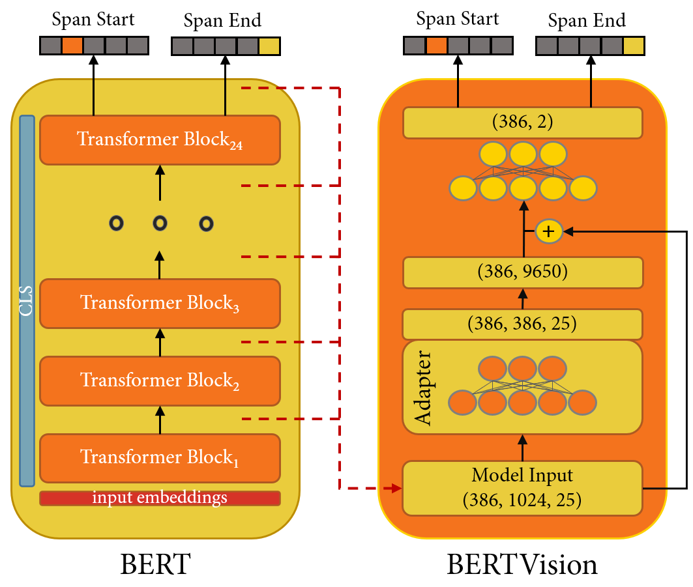

BERT Vision
==========================================================

      

#### Authors : [William Casey King, PhD](https://jackson.yale.edu/person/casey-king/) | [Siduo (Stone) Jiang](https://www.linkedin.com/in/siduojiang/) | [Cristopher Benge](https://cbenge509.github.io/) | [Andrew Fogarty](http://seekinginference.com/)

 
 

&nbsp;&nbsp;&nbsp;&nbsp;&nbsp;&nbsp;

U.C. Berkeley, Masters in Information & Data Science program - [datascience@berkeley](https://datascience.berkeley.edu/)  
Spring 2021, W210 - <i>Capstone Project</i> - [Alberto Todeschini, PhD](https://www.ischool.berkeley.edu/people/alberto-todeschini) | [Puya H. Vahabi, PhD](https://scholar.google.com/citations?user=rT9WRSsAAAAJ&hl=en)   
A continuation of our research from W266 - <i>Natural Language Processing</i> under the guidance of [Daniel Cer, PhD](https://scholar.google.com/citations?user=BrT1NW8AAAAJ&hl=en)

---

## Description

We present a highly parameter-efficient approach for Question Answering (QA) that significantly reduces the need for extended BERT fine-tuning. Our method uses information from the hidden state activations of each BERT transformer layer, which is discarded during typical BERT inference. Our best model achieves maximal BERT performance at a fraction of the training time and GPU/TPU expense. Performance is further improved by ensembling our model with BERT’s predictions. Furthermore, we find that near optimal performance can be achieved for QA span annotation using less training data. Our experiments show that this approach works well not only for span annotation, but also for classification, suggesting that it may be extensible to a wider range of tasks.

This repository contains the code, models, and documentation for the evaluation of leveraging parameter-efficient models, like those typically used in computer vision, for their potential utility in performing the NLP tasks of span annotation (aka "Q&A") and document binary classification. 

All models were trained on the hidden embedding activation states of BERT-large uncased and evaluated on the [Stanford Question Answering Dataset 2.0](https://rajpurkar.github.io/SQuAD-explorer/) (aka [SQuAD 2.0](https://rajpurkar.github.io/SQuAD-explorer/)).

#### Highlight of key files included in this repository:

  |File | Description |
  |:----|:------------|
  | [BERT Vision - Final Paper (ACL 2020 Format)](/paper/acl2020%20version/jiang_king_benge__w266_summer_2020_final.pdf) | Our final write-up and submission for review of analysis and findings in ACL 2020 format. |
  | [BERT Vision - Final Paper (Thesis Format)](/paper/acl2020%20version/jiang_king_benge__w266_summer_2020_final.pdf) | Our final write-up and submission for review of analysis and findings in masters thesis format (UC Berkeley palette). |
  | [BERT Vision - Presentation](/presentation/Jiang_King_Benge_W266_Final_Presentation.pptx) | Our presentation and overview of BERTVision. |
  | [Generate Span Annotation Embeddings](/notebooks/BERT_finetuning_Q_and_A_with_embedding_generation.ipynb) | Jupyter Notebook that walks through the extraction of hiden state activations from BERT (for span annotation) |
  | [BERT Fine Tuning - Span Annotation](/notebooks/BERT_finetuning_Q_and_A_with_embedding_generation.ipynb) | Jupyter Notebook that walks through the fine-tuning steps for BERT span annotation) |
  | [Generate Binary Classification Embeddings](/notebooks/Generate%20Binary%20Classification%20Embeddings.ipynb) | Jupyter Notebook that walks through the extraction of hiden state activations from BERT (for binary classification) |
  | [BERT Fine Tuning - Binary Classification](/notebooks/BERT%20Fine%20Tuning%20Binary%20Classification.ipynb) | Jupyter Notebook that walks through the fine-tuning steps for BERT classification) |
  | [Performance Reporting](/notebooks/Performance%20Reporting.ipynb) | Jupyter Notebook used to generate performance tables and plots resulting from model experiments. |
  |[Generate SQuAD 2.0 Features (Utility)](generate_squad_features.py) | Utility script that generates the train and dev tokens for BERT from the SQuAD v2 dataset |
  
---

Data Pipeline
-------------

For the task of span annotation, BERT was fine-tuned to 6 epochs on the SQuAD 2.0 train dataset and evaluated for accuracy and F1 score at each epoch.  Additionally, fractional epochs 1/10th through 9/10th were captured on the 0th to 1st epoch.  BERT was configured with a sequence length of 386 for all experiments, and during embedding extraction the full sequence length was retained for span annotation:

 

For the task of binary classification, BERT was fine-tuned to 6 epochs on the SQuAD 2.0 train dataset and evaluated for accuracy and F1 score at each epoch.  Additionally, fractional epochs 1/10th through 9/10th were captured on the 0th to 1st epoch.  BERT was configured with a sequence length of 386 for all experiments, however the sequence wasn't critical due to BERT's CLS token network.  Here, we retain a 1 x 1024 shape for each example:

---

Model Architecture
-----------

Architecture of our best performing span annotation model in relation to BERT$_{large}$.  Left: BERT and its span annotation inference process. Right: For our model, BERT embeddings are first transformed through our custom adapter layer. Next, the last two dimensions are flattened. Optionally, a skip connection is added between the sequence outputs of the final BERT layer and this flattened representation. This is present in the best model discovered at 3/10 of an epoch, but was not necessary for the best model discovered at 1 full epoch.  This tensor is then projected down to (386,2) with a densely connected layer and split on the last axis into two model heads. These heads represent the logits of the start-span and end-span position.

---

License
-------
Licensed under the MIT License. See [LICENSE](LICENSE.txt) file for more details.
