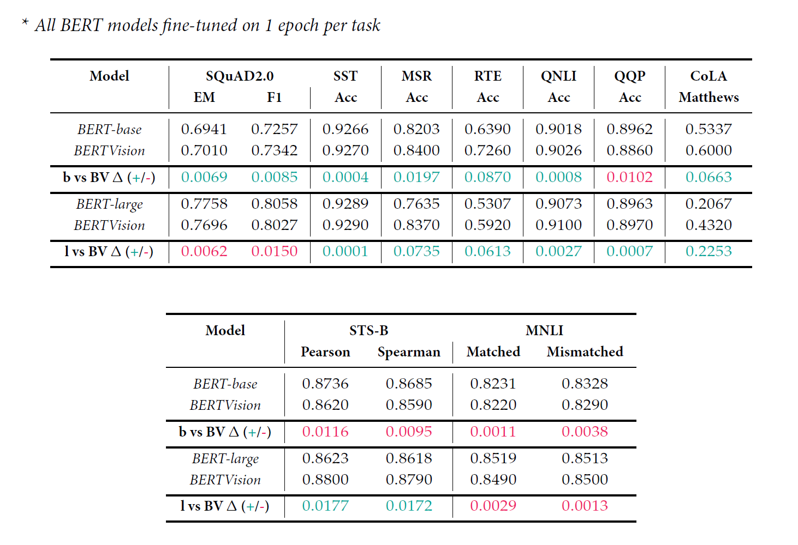

<center></center>
<br>

# Introduction to BERTVision

We present a highly parameter-efficient approach for a wide range of NLP tasks that significantly reduces the need for extended BERT fine-tuning. Our method uses information from the hidden state activations of each BERT transformer layer, which is discarded during typical BERT inference. Our best model achieves maximal BERT performance at a fraction of the training time and GPU/TPU expense. Performance is further improved by ensembling our model with BERT’s predictions. Furthermore, we find that near optimal performance can be achieved for some NLP tasks using less training data. 

All models were trained on the hidden embedding activation states of BERT-base and BERT-large uncased and evaluated on the [Stanford Question Answering Dataset 2.0](https://rajpurkar.github.io/SQuAD-explorer/) (aka [SQuAD 2.0](https://rajpurkar.github.io/SQuAD-explorer/)) and the [General Language Understanding Evaluation](https://gluebenchmark.com/) ([GLUE](https://gluebenchmark.com/)) benchmark data.

---

### How it Works: Data Pipeline

Training data for BERTVision is provided by extraction of the embeddings modestly updated within BERT during partial fine-tuning (i.e. fine-tuning using a small fraction of the data).  After partial fine-tuning, the entire training set is inferenced through BERT and embedding values are collected for each sample in the shape of (386,1024,25) for SQuAD (and similar for GLUE) - much like an image represetened in the shape of (H,W,C).  These training "images" are then fit to a much smaller model using our AdapterPooler technique, and are reduced along the depth dimension using a simple linear pooling technique adapted from [Tenney et. al](https://arxiv.org/pdf/1905.05950.pdf)'s *edge probing* method.

**Depicted below: extraction of data for Span Annotation Task**

<center></center>
<br>

---

### How it Works: Model Architecture

BERT embeddings from all encoder layers are first transformed through our customer adapter layer (referred to as *LayerWeightShare* in the paper).  Next, the last two dimensions output from the adapter are flattened, and a residual skip connection to the original input is combined with them before being projected down for final inferencing.  Depicted below is the architecture for the span annotation task; the tensor is projected down to a size of (386,2) with a densely connected layer and split on the last axis into two model heads.  These represent the logits of the start-span and end-span position for the span annotation task; for other tasks, the output sequence varies depending on the task goal.

<center></center>
<br>

---

### How it Works: Model Development & Training

Our development and experiementation was performed in an Infrastructure-as-a-Service topology consisting of two NVIDIA Tesla V100 GPU-backed virtual machines in the Microsoft Azure cloud.  Data was stored on virtually attached SSD's utilizing approximately 20TiB combined.  Our development enviornment consisted of Python v3.8.5, TensorFLow v2.4.1, and PyTorch v1.7.1. Visualization support was provided primarily through the Altair v4.1.0 and Plotly v4.14.3 libraries, and all documentation was managed through LaTeX.  Azure DevOps (Boards) and GitHub (repositories) were used to managed project and code, respectively.

<center></center>
<br>

---

# NLP Tasks & Data

We evaluated the effectiveness and efficiency of BERTVision on two industry benchmark datasets:  [The General Language Understanding Evaluation (GLUE)](https://gluebenchmark.com/) benchmark, and the [Stanford Question Answering Dataset (SQuAD)](https://rajpurkar.github.io/SQuAD-explorer/) $v2.0$.
### SQuAD 2.0 Datasets

The Stanford Question Answering Dataset (SQuAD) is a reading comprehension dataset, consisting of questions posed by crowdworkers on a set of Wikipedia articles, where the answer to every question is a segment of text, or span, from the corresponding reading passage, or the question might be unanswerable. SQuAD v2.0 combines the 100,000 questions in SQuAD v1.1 with over 50,000 unanswerable questions written adversarially by crowdworkers to look similar to answerable ones. To do well on SQuAD2.0, systems must not only answer questions when possible, but also determine when no answer is supported by the paragraph and abstain from answering.

| Dataset | Description | NLP Task | Metric | Size |
|:--------|:------------|:--------:|:------:|------|
| [SQuAD 2.0](https://rajpurkar.github.io/SQuAD-explorer/) | A reading comprehension dataset prepared by crowdworkers on a set of Wikipedia articles. | [span annotation](https://en.wikipedia.org/wiki/Question_answering), [classification](https://en.wikipedia.org/wiki/Binary_classification) | [Exact Match](https://web.stanford.edu/class/archive/cs/cs224n/cs224n.1174/reports/2761899.pdf), [F1](https://en.wikipedia.org/wiki/F-score) | ~150k |

### GLUE Benchmark Datasets

The General Language Understanding Evaluation (GLUE) benchmark is a collection of resources for training, evaluating, and analyzing natural language understanding systems. GLUE consists of:

 - A benchmark of nine sentence- or sentence-pair language understanding tasks built on established existing datasets and selected to cover a diverse range of dataset sizes, text genres, and degrees of difficulty,
 - A diagnostic dataset designed to evaluate and analyze model performance with respect to a wide range of linguistic phenomena found in natural language, and
 - A public leaderboard for tracking performance on the benchmark and a dashboard for visualizing the performance of models on the diagnostic set.

The format of the GLUE benchmark is model-agnostic, so any system capable of processing sentence and sentence pairs and producing corresponding predictions is eligible to participate. The benchmark tasks are selected so as to favor models that share information across tasks using parameter sharing or other transfer learning techniques. The ultimate goal of GLUE is to drive research in the development of general and robust natural language understanding systems.

| Dataset | Description | NLP Task | Metric | Size |
|:--------|:------------|:--------:|:------:|------|
| [CoLA](https://nyu-mll.github.io/CoLA/) | Corpus of Linguistic Acceptability | Acceptability | Matthews | ~10k |
| [SST-2](https://nlp.stanford.edu/sentiment/index.html) | Standford Sentiment Treebank | Sentiment | Accuracy | ~67k |
| [MSR](https://www.microsoft.com/en-us/download/details.aspx?id=52398) | Microsoft Research Paraphrase Corpus | Paraphrase | Accuracy, F1 | ~4k |
| [STS-B](https://www.aclweb.org/anthology/S17-2001) | Semantic Textual Similarity Benchmark | Sentence Similarity | Pearson / Spearman | ~7k |
| [QQPairs](https://www.quora.com/q/quoradata/First-Quora-Dataset-Release-Question-Pairs) | Quora Question Pairs | Paraphrase | Accuracy, F1 | ~400k |
| [MNLI](https://www.nyu.edu/projects/bowman/multinli/) | Multi-Genre Natural Language Inference Corpus | Natural Language Inference | Accuracy | . |
| [QNLI](https://rajpurkar.github.io/SQuAD-explorer/) | SQuAD dataset | QA / NLI | Accuracy | ~110k |
| [RTE](https://aclweb.org/aclwiki/Textual_Entailment_Resource_Pool) | Recognizing Textual Entailment | Natural Language Inference | Accuracy | ~3k |
| [WNLI](https://cs.nyu.edu/faculty/davise/papers/WinogradSchemas/WS.html) | Winnograd Natural Lanugage Inference | Natural Language Inference | Accuracy | ~1k |

---

# Our Results

### Hyperparameter Searching

We use `hyperopt` to search over parameters and tune our models. We find that the smaller data sets are far more sensitive to tuning than the larger ones. To replicate our tuning processes, please use the following commands:

```bash
python -m models.hypersearch --model MSR --checkpoint bert-large-uncased --batch-size 32 --num-labels 2 --max-seq-length 128
python -m models.ap_hypersearch --model AP_STSB --checkpoint bert-base-uncased --batch-size 16 --num-labels 1 --max-seq-length 128
```

For large data sets, e.g., MNLI, QNLI, QQP, and SST, data set sharding is enabled automatically, which randomly samples 10% of the data set to train on to speed up the parameter search. shard is manipulable and can be set by:

```bash
python -m models.ap_hypersearch --model AP_QQP --checkpoint bert-base-uncased --batch-size 32 --num-labels 2 --max-seq-length 128 --shard 0.
```

The table below displays the commonly recommended general hyperparameters for each GLUE task. The BERTVision embeddings were generated based on these parameters:

| BERT-(base/large) | MNLI | QNLI | QQP | RTE | SST | MSR | CoLA | STS-B |
|:------------------|:-----|:-----|:----|:----|:----|:----|:-----|:------|
| `--num-labels`    | 3    | 2    | 2   | 2   | 2   | 2   | 2    | 1     |
| `--lr`            | 1e-5 | 1e-5 | 1e-5|2e-5 | 2e-5|2e-5 | 2e-5 | 2e-5  |
| `--batch-size`    | 32   | 32   | 32  | 16  | 32  | 32  | 16   | 16    |
| `--max-seq-length`| 128  | 128  | 128 | 250 | 128 | 128 | 128  | 128   |

### Results Table : BERT-(base/large} vs. BERTVision (All Tasks)



In the following sections we outline the individual results per NLP task and provide the code required to replicate our results:

## GLUE Tasks
### Results : QQP

To replicate our results, please run the follow commands from `BERTVision\code\torch`:

```bash
python -m models.bert_glue --model QQP --checkpoint bert-base-uncased --lr 1e-5 --num-labels 2 --max-seq-length 128 --batch-size 32
python -m models.ap_glue --model AP_QQP --checkpoint bert-base-uncased --lr 1e-5 --num-labels 2 --max-seq-length 128 --batch-size 32

python -m models.bert_glue --model QQP --checkpoint bert-large-uncased --lr 1e-5 --num-labels 2 --max-seq-length 128 --batch-size 32
python -m models.ap_glue --model AP_QQP --checkpoint bert-large-uncased --lr 1e-5 --num-labels 2 --max-seq-length 128 --batch-size 32
```

|              | BERT-base | BERT-large | BERTVision-base | BERTVision-large |
|:-------------|:---------:|:----------:|:---------------:|:----------------:|
|**Accuracy**  | 0.8890    | 0.8690     | 0.8860          | 0.8970           |

### Results : QNLI

To replicate our results, please run the follow commands from `BERTVision\code\torch`:

```bash
python -m models.bert_glue --model QNLI --checkpoint bert-base-uncased --lr 1e-5 --num-labels 2 --max-seq-length 128 --batch-size 32
python -m models.ap_glue --model AP_QNLI --checkpoint bert-base-uncased --lr 2.0021e-5 --num-labels 2 --max-seq-length 128 --batch-size 32 --seed 770

python -m models.bert_glue --model QNLI --checkpoint bert-large-uncased --lr 1e-5 --num-labels 2 --max-seq-length 128 --batch-size 32
python -m models.ap_glue --model AP_QNLI --checkpoint bert-large-uncased --lr 1e-5 --num-labels 2 --max-seq-length 128 --batch-size 32
```

|              | BERT-base | BERT-large | BERTVision-base | BERTVision-large |
|:-------------|:---------:|:----------:|:---------------:|:----------------:|
|**Accuracy**  | 0.9010    | 0.9120     | 0.8920          | 0.9100           |

### Results : MNLI

To replicate our results, please run the follow commands from `BERTVision\code\torch`:

```bash
python -m models.bert_glue --model MNLI --checkpoint bert-base-uncased --lr 1e-5 --num-labels 3 --max-seq-length 128 --batch-size 32
python -m models.ap_glue --model AP_MNLI --checkpoint bert-base-uncased --lr 1e-5 --num-labels 3 --max-seq-length 128 --batch-size 32

python -m models.bert_glue --model MNLI --checkpoint bert-large-uncased --lr 1e-5 --num-labels 3 --max-seq-length 128 --batch-size 32
python -m models.ap_glue --model AP_MNLI --checkpoint bert-large-uncased --lr 1e-5 --num-labels 3 --max-seq-length 128 --batch-size 32
```

|                         | BERT-base | BERT-large | BERTVision-base | BERTVision-large |
|:------------------------|:---------:|:----------:|:---------------:|:----------------:|
|**Matched Accuracy**     | 0.8240    | 0.8530     | 0.8220          | 0.8490           |
|**Mismatched Accuracy**  | 0.8290    | 0.8510     | 0.8290          | 0.8500           |

### Results : RTE

To replicate our results, please run the follow commands from `BERTVision\code\torch`:

```bash
python -m models.bert_glue --model RTE --checkpoint bert-base-uncased --lr 1.2220e-5 --num-labels 2 --max-seq-length 250 --batch-size 16 --seed 600
python -m models.ap_glue --model AP_RTE --checkpoint bert-base-uncased --lr 0.0003593259178474023 --num-labels 2 --max-seq-length 250 --adapter-dim 8 --batch-size 16 --seed 926

python -m models.bert_glue --model RTE --checkpoint bert-large-uncased --lr 8.3621e-6 --num-labels 2 --max-seq-length 250 --batch-size 16 --seed 244
python -m models.ap_glue --model AP_RTE --checkpoint bert-large-uncased --lr 1.2614e-5 --num-labels 2 --max-seq-length 250 --batch-size 16 --seed 414
```

|              | BERT-base | BERT-large | BERTVision-base | BERTVision-large |
|:-------------|:---------:|:----------:|:---------------:|:----------------:|
|**Accuracy**  | 0.6570    | 0.6640     | 0.7260          | 0.5920           |

### Results : SST

To replicate our results, please run the follow commands from `BERTVision\code\torch`:

```bash
python -m models.bert_glue --model SST --checkpoint bert-base-uncased --lr 2e-5 --num-labels 2 --max-seq-length 128 --batch-size 32
python -m models.ap_glue --model AP_SST --checkpoint bert-base-uncased --lr 0.0009739884755578448 --num-labels 2 --max-seq-length 128 --adapter-dim 32 --batch-size 64 --seed 1788

python -m models.bert_glue --model SST --checkpoint bert-large-uncased --lr 2e-5 --num-labels 2 --max-seq-length 128 --batch-size 32
python -m models.ap_glue --model AP_SST --checkpoint bert-large-uncased --lr 2e-5 --num-labels 2 --max-seq-length 128 --batch-size 32
```

|              | BERT-base | BERT-large | BERTVision-base | BERTVision-large |
|:-------------|:---------:|:----------:|:---------------:|:----------------:|
|**Accuracy**  | 0.9200    | 0.9330     | 0.9270          | 0.9290           |

### Results : MSR

To replicate our results, please run the follow commands from `BERTVision\code\torch`:

```bash
python -m models.bert_glue --model MSR --checkpoint bert-base-uncased --lr 2.4380e-5 --num-labels 2 --max-seq-length 128 --batch-size 32 --seed 734
python -m models.ap_glue --model AP_MSR --checkpoint bert-base-uncased --lr 0.0007591458513071305 --num-labels 2 --max-seq-length 128 --adapter-dim 16 --batch-size 16 --seed 926

python -m models.bert_glue --model MSR --checkpoint bert-large-uncased --lr 1.2771e-5 --num-labels 2 --max-seq-length 128 --batch-size 32 --seed 158
python -m models.ap_glue --model AP_MSR --checkpoint bert-large-uncased --lr 1.4399e-5 --num-labels 2 --max-seq-length 128 --batch-size 32 --seed 465
```

|              | BERT-base | BERT-large | BERTVision-base | BERTVision-large |
|:-------------|:---------:|:----------:|:---------------:|:----------------:|
|**Accuracy**  | 0.8280    | 0.7680     | 0.8400          | 0.8370           |

### Results : CoLA

To replicate our results, please run the follow commands from `BERTVision\code\torch`:

```bash
python -m models.bert_glue --model CoLA --checkpoint bert-base-uncased --lr 9.6296e-6 --num-labels 2 --max-seq-length 128 --batch-size 16 --seed 441
python -m models.ap_glue --model AP_CoLA --checkpoint bert-base-uncased --lr 2.25972e-5 --num-labels 2 --max-seq-length 128 --batch-size 16 --seed 563

python -m models.bert_glue --model CoLA --checkpoint bert-large-uncased --lr 9.4471e-6 --num-labels 2 --max-seq-length 128 --batch-size 16 --seed 203
python -m models.ap_glue --model AP_CoLA --checkpoint bert-large-uncased --lr 2.99619e-5 --num-labels 2 --max-seq-length 128 --batch-size 16 --seed 949
```

|              | BERT-base | BERT-large | BERTVision-base | BERTVision-large |
|:-------------|:---------:|:----------:|:---------------:|:----------------:|
|**Matthews**  | 0.5650    | 0.5960     | 0.6000          | 0.4320           |

### Results : STS-B

To replicate our results, please run the follow commands from `BERTVision\code\torch`:

```bash
python -m models.bert_glue --model STSB --checkpoint bert-base-uncased --lr 1.86524e-5 --num-labels 1 --max-seq-length 128 --batch-size 16 --seed 637
python -m models.ap_glue --model AP_STSB --checkpoint bert-base-uncased --lr 2.7762e-5 --num-labels 1 --max-seq-length 128 --batch-size 16 --seed 260

python -m models.bert_glue --model STSB --checkpoint bert-large-uncased --lr 7.1099e-6 --num-labels 1 --max-seq-length 128 --batch-size 16 --seed 701
python -m models.ap_glue --model AP_STSB --checkpoint bert-large-uncased --lr 2.98363e-5 --num-labels 1 --max-seq-length 128 --batch-size 16 --seed 131
```

|                | BERT-base | BERT-large | BERTVision-base | BERTVision-large |
|:---------------|:---------:|:----------:|:---------------:|:----------------:|
|**Pearson**     | 0.8880    | 0.8940     | 0.8620          | 0.8800           |
|**Spearman**    | 0.8860    | 0.8910     | 0.8590          | 0.8790           |

## SQuAD v2.0

To replicate our results, please run the follow commands from `BERTVision\code\torch`:

```bash
python -m models.bert_squad --model SQuAD --checkpoint bert-base-uncased --lr 2e-5 --max-seq-length 384 --batch-size 16
python -m models.ap_squad --model AP_SQuAD --checkpoint bert-base-uncased --lr 2e-5 --max-seq-length 384 --batch-size 16

python -m models.bert_squad --model SQuAD --checkpoint bert-large-uncased --lr 2e-5 --max-seq-length 384 --batch-size 8
python -m models.ap_squad --model AP_SQuAD --checkpoint bert-large-uncased --lr 2e-5 --max-seq-length 384 --batch-size 8
```

### Results : SQuAD
---

|                   | BERT-base | BERT-large | BERTVision-base | BERTVision-large |
|:------------------|:---------:|:----------:|:---------------:|:----------------:|
|**Exact Match**    | 0.6941    | 0.7758     | 0.7010          | 0.7696           |
|**F1**             | 0.7257    | 0.8058     | 0.7342          | 0.8027           |

# Replication of Embeddings

The BERTVision architecture relies on the generation of embeddings from the hidden-state activations within BERT to form a training and inference dataset.  The code to replicate our results and generate these embeddings is provided in the following subsection.  Please note that these embeddings will require several TiB of available disk space to generate and store.

## GLUE

To replicate our AdapterPooler models, you must first output 1-epoch fine-tuned BERT embeddings. The commands below will fine tune BERT, generate the embeddings, and should be run from the following directory `BERTVision\code\torch\gen_embeds`:
### QQP Embeddings

```bash
python qqpairs_embeds.py --checkpoint bert-base-uncased --lr 1e-5 --num-labels 2 --max-seq-length 128 --batch-size 32
python qqpairs_embeds.py --checkpoint bert-large-uncased --lr 1e-5 --num-labels 2 --max-seq-length 128 --batch-size 32
```

### QNLI Embeddings

```bash
python qnli_embeds.py --model QNLI --checkpoint bert-base-uncased --lr 1e-5 --num-labels 2 --max-seq-length 128 --batch-size 32
python qnli_embeds.py --model QNLI --checkpoint bert-large-uncased --lr 1e-5 --num-labels 2 --max-seq-length 128 --batch-size 32
```

### MNLI Embeddings

```bash
python mnli_embeds.py --checkpoint bert-base-uncased --lr 1e-5 --num-labels 3 --max-seq-length 128 --batch-size 32
python mnli_embeds.py --checkpoint bert-large-uncased --lr 1e-5 --num-labels 3 --max-seq-length 128 --batch-size 32
```

### STS-B Embeddings

```bash
python stsb_embeds.py --checkpoint bert-base-uncased --lr 2e-5 --num-labels 1 --max-seq-length 128 --batch-size 16
python stsb_embeds.py --checkpoint bert-large-uncased --lr 2e-5 --num-labels 1 --max-seq-length 128 --batch-size 16
```

### CoLA Embeddings

```bash
python cola_embeds.py --checkpoint bert-base-uncased --lr 2e-5 --num-labels 2 --max-seq-length 128 --batch-size 16
python cola_embeds.py --checkpoint bert-large-uncased --lr 2e-5 --num-labels 2 --max-seq-length 128 --batch-size 16
```

### MSR Embeddings

```bash
python msr_embeds.py --checkpoint bert-base-uncased --lr 2e-5 --num-labels 2 --max-seq-length 128 --batch-size 32
python msr_embeds.py --checkpoint bert-large-uncased --lr 2e-5 --num-labels 2 --max-seq-length 128 --batch-size 32
```

### SST Embeddings

```bash
python sst_embeds.py --checkpoint bert-base-uncased --lr 2e-5 --num-labels 2 --max-seq-length 128 --batch-size 32
python sst_embeds.py --checkpoint bert-large-uncased --lr 2e-5 --num-labels 2 --max-seq-length 128 --batch-size 32
```

### RTE Embeddings

```bash
python rte_embeds.py --checkpoint bert-base-uncased --lr 2e-5 --num-labels 2 --max-seq-length 250 --batch-size 16
python rte_embeds.py --checkpoint bert-large-uncased --lr 2e-5 --num-labels 2 --max-seq-length 250 --batch-size 16
```

## SQuAD v2.0

To replicate our AdapterPooler models, you must first output 1-epoch fine-tuned BERT embeddings. The commands below will fine tune BERT, generate the embeddings, and should be run from the following directory `BERTVision\code\torch\gen_embeds`:

### SQuAD Embeddings

```bash
python squad_embeds.py --checkpoint bert-base-uncased --lr 2e-5 --max-seq-length 384 --batch-size 16
python squad_embeds.py --checkpoint bert-large-uncased --lr 2e-5 --max-seq-length 384 --batch-size 8
```

# Read the Paper

To read the full paper, please direction your attention to : **[BERTVision: A Parameter-Efficient Approach for BERT-based NLP Tasks](./paper/BERTVision_2020.pdf)**

